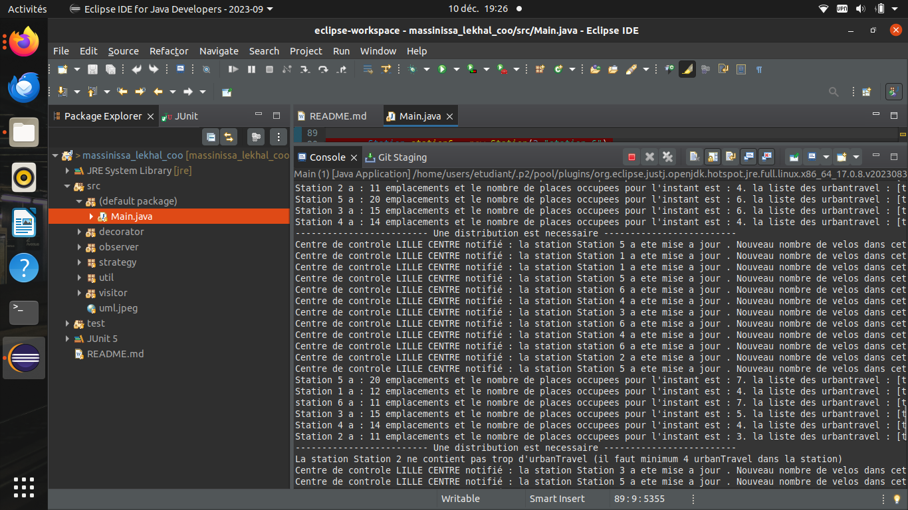

# Massinissa_Lekhal_COO


## HOW TO

- Récupération du dépôt : ```git clone git@gitlab-etu.fil.univ-lille.fr:massinissa.lekhal.etu/massinissa_lekhal_coo.git ```i
- Géneration de la documentation :``` javadoc -sourcepath src -d docs -subpackages decorator observer strategy util visitor ```
- Compilation :
1. ``` javac -sourcepath src -d classes src/*/*.java ```  
2. ``` javac -sourcepath src -d classes src/*.java ```
- Exécution :``` java -classpath classes Main ```
- Compilation des tests : ``` javac -cp classes:junit-platform-console-standalone-1.9.1.jar -d classes test/*/*.java ```
- Exécution des tests : ``` java -jar junit-platform-console-standalone-1.9.1.jar  -cp classes --scan-class-path ```
- Génération de l'archive du projet aprés la compilation : ``` jar cvfe main.jar Main -C classes .```
- Exécution de l'archive :``` java -jar main.jar```	

## Présentation des principes de conception mis en oeuvres 

- Test-Driven Development en commençant par l'ecriture des tests
- Le polymorphisme avec nos différents type de UrbanTravel .
- Design pattern **Decorator** pour decorer nos UrbanTravel avec par exemple des **Basket** , **LuggageRacks** ou **PhoneSupport** 
- Design pattern **Observer** pour que le centre de controle supervise les stations et donc il sera notifié a chaque depot ou location d'un urbanTravel
- Design pattern **Strategy** pour le choix de la redidtribution , pour ajouter des nouvelles strategies il suffit juste de creer les classes correspondante toute en implementant l'interface de strategy
- design pattern **Visitor** pour les différents visitors qui vont intervenir sur les UrbanTravel


## Explication du programme principale **Main** 

### Creation des UrbanTravel : 

- Trente UrbanTravels ont été créés, comprenant à la fois des versions régulières et décorées avec des accessoires tels que des paniers, des porte-bagages et des supports de téléphone


###  Mise en place des stations et un centre de controle qui va être le superviseur : 

- Cinq stations et un centre de contrôle ont été établis pour superviser le système UrbanTravel.

- Les cinq stations ont été initialement équipées des trente UrbanTravels créés précédemment. La distribution a été manuelle, car la distribution basée sur une stratégie nécessite un minimum de quatre UrbanTravels dans une station pour déclencher une redistribution.


### Tentative d'une location d'un urbanTravel (Dans une station qui a juste des urbanTravel INDISPONIBLES): 

- Les UrbanTravels de la première station ont été modifié en INDISPONIBLES.

- Une tentative de location d'un UrbanTravel dans la première station a affiché un message indiquant que tous les UrbanTravels étaient INDISPONIBLES .


### Tentative d'une location d'un urbanTravel (Dans une station qui a au moins un urbanTravel DISPONIBLES):

- La location d'un UrbanTravel dans la deuxième station a réussi car il existe au moins un UrbanTravels qui est DISPONIBLES.

### Tentative d'une location d'un urbanTravel (dans une station vide) : 

- Une sixième station vide a été créée.

- La tentative de location d'un UrbanTravel dans la sixième station vide a affiché un message indiquant qu'il n'était pas possible de louer en raison de la vacuité de la station.


### Test de la limite maximale de location d'un urbanTravel : 

- Un UrbanTravel a été ajouté à la sixième station et loué (la station sera vide ce qui declenche une redistribution automatique)

- Le même UrbanTravel a été rendu à la sixième station et loué quatre fois de plus pour atteindre la limite maximale de locations.

- Tentative d'une autre location n'est pas possible et Un mécanicien intervient après avoir atteint la limite maximale de locations, rendant l'UrbanTravel DISPONIBLE

- Cinq redistributions ont eu lieu dans la sixième station en raison des actions répétées de location et de retour, entraînant la vacuité de la station à cinq reprises.





**Ces tests complets fournissent une vue d'ensemble des différents scénarios, de l'indisponibilité à la vacuité des stations, et de la réaction du système à l'atteinte de la limite maximale de locations. L'introduction de mécaniciens et de redistributions renforce la réalisme de la simulation**

